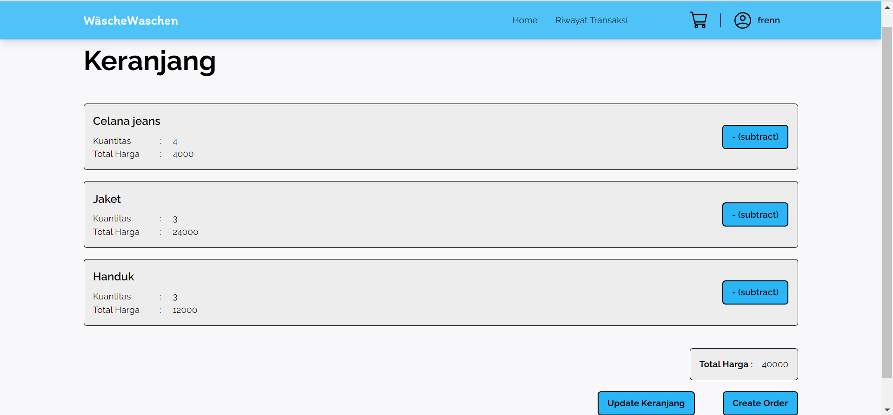
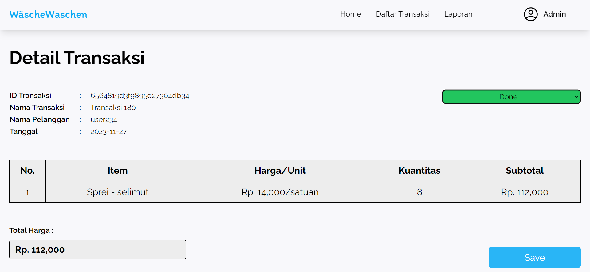

<div align="center">
    <h1>Tugas Besar</h1>
    <h3>IFIF3152 - Software Engineering IST</h3>
    <h4>Kelompok 3</h4>
</div>
<br>

<div align="center">
    
</div>

## List of Contents
1. [Description](#description)
2. [Group's Members](#groups-members)
3. [Tech Stack](#tech-stack)
4. [How to Run](#how-to-run)
5. [Database Table](#database-table)
6. [List of Use Cases and the Implementers](#list-of-use-cases-and-the-implementers)

## Description
Perangkat lunak Wäsche waschen merupakan sebuah sistem manajemen laundry berbasis website. Aplikasi ini dibuat untuk mengotomatisasi beberapa proses bisnis dalam bisnis laundry sehingga dapat meningkatkan efisiensi operasional bisnis.

## Group's Members
<table>
    <tr align="center">
        <th>No.</th>
        <th>Nama</th>
        <th>NIM</th>
    </tr>
    <tr align="center">
        <td>1.</td>
        <td>Frendy Sanusi</td>
        <td>18221041</td>
    </tr>
    <tr align="center">
        <td>2.</td>
        <td>Ahmad Rizki</td>
        <td>18221071</td>
    </tr>
    <tr align="center">
        <td>3.</td>
        <td>Jonathan Arthurito Aldi Sinaga</td>
        <td>18221079</td>
    </tr>
    <tr align="center">
        <td>4.</td>
        <td>Rasyadan Faza Safiqur Rahman</td>
        <td>18221103</td>
    </tr>
</table>

## Tech Stack
* TypeScript v5.0
* NextJS v14.0.1
* React v18.0
* Tailwind
* MongoDB
* Cypress (testing)

## How to run
### By localhost
1. Clone respository ini

2. Copy file .env pada link berikut
<br>https://drive.google.com/file/d/17x_NA3kzNUCkU6VmrA1oGRtvlHGO_CFm/view?usp=sharing
<br><br>Note: file .env merupakan file rahasia sehingga hanya user tertentu saja yang bisa membuka link tersebut

3. Jalankan aplikasi menggunakan command berikut
```
npm run program
```

4. Buka http://localhost:3000 pada browser Anda

### By website
1. Buka https://wasche-waschen.vercel.app/ pada browser Anda

2. Beres :D

## Database Table
<table>
    <tr align="center">
        <th>No.</th>
        <th>Nama Tabel</th>
        <th>Atribut</th>
        <th>Tipe Atribut</th>
    </tr>
    <tr align="center">
        <td rowspan="6">1.</td>
        <td rowspan="6">User</td>
        <td>id</td>
        <td>String</td>
    </tr>
    <tr align="center">
        <td>email</td>
        <td>String</td>
    </tr>
    <tr align="center">
        <td>name</td>
        <td>String</td>
    </tr>
    <tr align="center">
        <td>no_telp</td>
        <td>String</td>
    </tr>
    <tr align="center">
        <td>hashedPassword</td>
        <td>String</td>
    </tr>
    <tr align="center">
        <td>role</td>
        <td>String</td>
    </tr>
    <!-- Pakaian -->
    <tr align="center">
        <td rowspan="4">2.</td>
        <td rowspan="4">Pakaian</td>
        <td>id</td>
        <td>String</td>
    </tr>
    <tr align="center">
        <td>name</td>
        <td>String</td>
    </tr>
    <tr align="center">
        <td>price</td>
        <td>integer</td>
    </tr>
    <tr align="center">
        <td>unit</td>
        <td>String</td>
    </tr>
    <!-- ExistingPakaian -->
    <tr align="center">
        <td rowspan="5">3.</td>
        <td rowspan="5">ExistingPakaian</td>
        <td>id</td>
        <td>String</td>
    </tr>
    <tr align="center">
        <td>name</td>
        <td>String</td>
    </tr>
    <tr align="center">
        <td>price</td>
        <td>integer</td>
    </tr>
    <tr align="center">
        <td>unit</td>
        <td>String</td>
    </tr>
    <tr align="center">
        <td>pakaianId</td>
        <td>String</td>
    </tr>
    <!-- Transaksi -->
    <tr align="center">
        <td rowspan="6">4.</td>
        <td rowspan="6">Transaksi</td>
        <td>id</td>
        <td>String</td>
    </tr>
    <tr align="center">
        <td>nama</td>
        <td>String</td>
    </tr>
    <tr align="center">
        <td>total_harga</td>
        <td>integer</td>
    </tr>
    <tr align="center">
        <td>status</td>
        <td>String</td>
    </tr>
    <tr align="center">
        <td>tanggal</td>
        <td>String</td>
    </tr>
    <tr align="center">
        <td>userId</td>
        <td>String</td>
    </tr>
    <!-- Orderline -->
    <tr align="center">
        <td rowspan="7">5.</td>
        <td rowspan="7">Orderline</td>
        <td>id</td>
        <td>String</td>
    </tr>
    <tr align="center">
        <td>kuantitas</td>
        <td>integer</td>
    </tr>
    <tr align="center">
        <td>total_harga</td>
        <td>integer</td>
    </tr>
    <tr align="center">
        <td>noted</td>
        <td>String</td>
    </tr>
    <tr align="center">
        <td>pakaianId</td>
        <td>String</td>
    </tr>
    <tr align="center">
        <td>keranjangId</td>
        <td>String</td>
    </tr>
    <tr align="center">
        <td>transaksiId</td>
        <td>String</td>
    </tr>
    <!-- Keranjang -->
    <tr align="center">
        <td rowspan="2">6.</td>
        <td rowspan="2">Keranjang</td>
        <td>id</td>
        <td>String</td>
    </tr>
    <tr align="center">
        <td>userId</td>
        <td>String</td>
    </tr>
</table>

## List of Use Cases and the Implementers
1. Mendaftarkan Akun (18221103 Rasyadan Faza Safiqur Rahman)


2. Masuk ke Akun (18221103 Rasyadan Faza Safiqur Rahman)


3. Melihat Daftar Pakaian (18221041 Frendy Sanusi)


4. Mencari Jenis Pakaian (18221041 Frendy Sanusi)


5. Menambah Pakaian ke Keranjang (18221079 Jonathan Arthurito Aldi Sinaga)


6. Melihat Total Harga (18221079 Jonathan Arthurito Aldi Sinaga)
<br>Sama dengan page use case 5

7. Membuat Pesanan Baru (18221079 Jonathan Arthurito Aldi Sinaga)
<br>Sama dengan page use case 8

8. Melihat Riwayat Transaksi (18221071 Ahmad Rizki)


9. Mengubah Harga Pakaian (18221041 Frendy Sanusi)


10. Mengubah Daftar Pakaian (18221041 Frendy Sanusi)


11. Melihat Daftar Transaksi (18221071 Ahmad Rizki)


12. Melihat Detail Transaksi (18221071 Ahmad Rizki)


13. Mengubah Status Pesanan (18221071 Ahmad Rizki)


14. Melihat Laporan (18221103 Rasyadan Faza Safiqur Rahman)


15. Page Profile (18221071)

